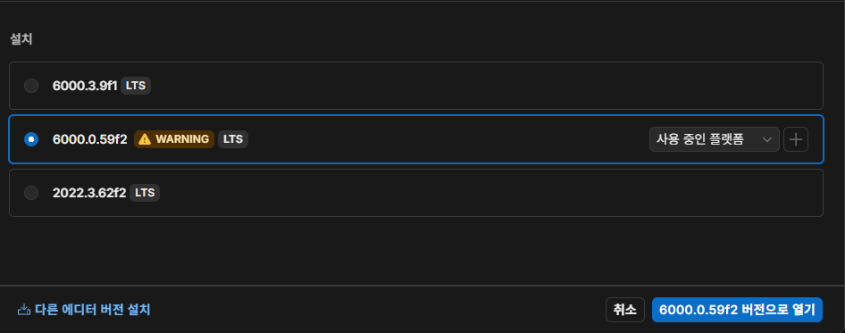

 # 트러블 발생 26_02_27

 트러블 1
 -  유니티 6000.3.9f1 버전으로 프로젝트 시작  
      - **문제 :** 캐릭터 컨트롤러 사용해서 이동구현했는데 렉걸림
      
      - **문제 해결 시도 :**  
        - 1.코드 문제인가 싶어서 확인하니 코드 문제는 X
        - 2.PC성능 문제인가 추측
        - 3.PC 및 유니티 엔진 재시작 4회 시도 (해결X)
        - 4.버전을 6000.0.59f2로 내렸는데 렉 안걸림(해결)
      - 문제 해결 : 버전 문제로 확인 된거 같아서   현재  
      6000.0.59f2는 경고 표시 떠서 2022.3.62f2로 다시 만들어서 진행

---

트러블 2  

3D모델,믹사모에서 가져오 캐릭터와 애니메이션 사용 하여  
 캐릭터 제작 중 움직임 관련 애니메이션에서 문제 발생

- 문제 상황  
  - 1.앞뒤 이동처리는 잘 됐지만 좌우 이동시 대각선 뒤 이동하는 문제 발생

- 문제 해결 시도
  - 1.인터넷 검색하여 비슷한 이슈 찾아봄

- 문제 해결
 

  
   - 루트 트랜스폼 설정  
     - **루트 모션(Root Motion)** 이라는 개념과 직결됩니다.  
    애니메이션 안에 포함된 이동/회전 값을 게임 오브젝트의 실제 좌표에 반영할지, 아니면 애니메이션 자체에만 남겨둘지(Bake) 결정합니다.  
     
      - **Bake Into Pose (체크 해제 시):** 애니메이션 자체의 움직임이 게임 오브젝트의 실제 Transform을 이동시킵니다. 즉, Animator 컴포넌트에서 'Apply Root Motion'이 켜져 있다면, 이 애니메이션이 재생될 때 캐릭터가 실제로 뒤로 스르륵 이동합니다.  
     
      - **Bake Into Pose (체크 시):** 오브젝트의 Transform은 가만히 있고 캐릭터가 제자리에서 걷는 시늉만 합니다. 만약 스크립트(C#)에서 transform.Translate나 Rigidbody 속도를 제어하여 캐릭터를 직접 이동시킬 계획이라면, 보통 이 옵션을 체크하여 '제자리 걷기(In-place)' 애니메이션으로 만들어 사용합니다.

- 루트 모션이 무엇인가?
  - 애니메이션 안에 들어있는 “이동 데이터”를 실제 오브젝트 이동에 사용하는 것
  - 코드로 안 움직여도애니메이션 재생하면 캐릭터가 앞으로 감.  
  - 애니메이션 자체에 “앞으로 이동” 데이터 포함   
  - 루트 본(root bone)이 실제로 이동함

